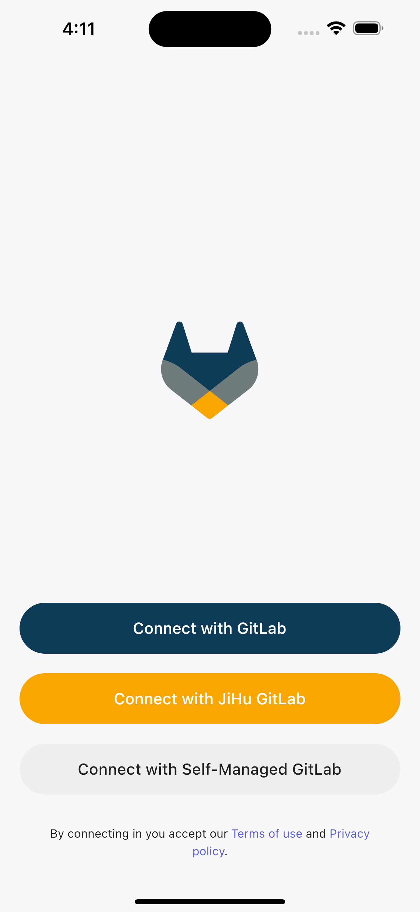
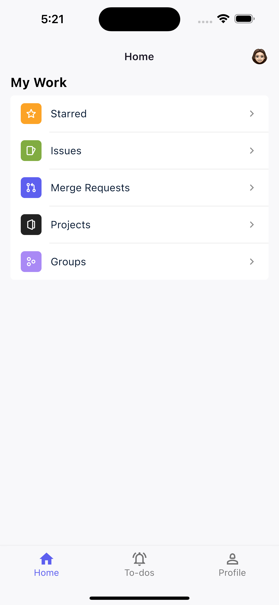
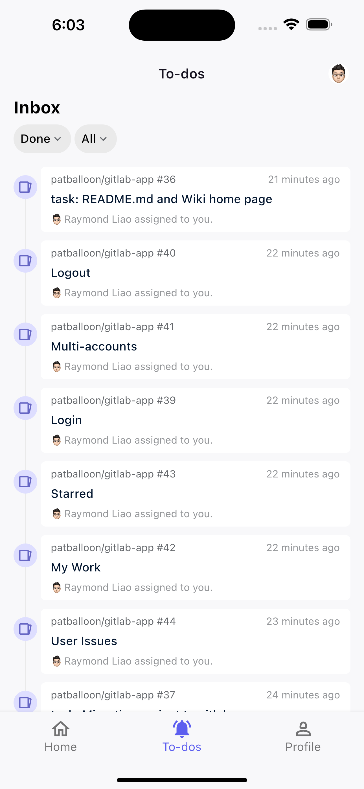
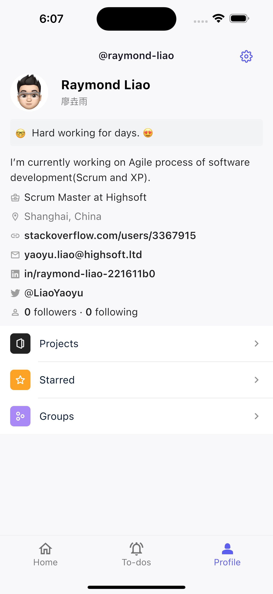
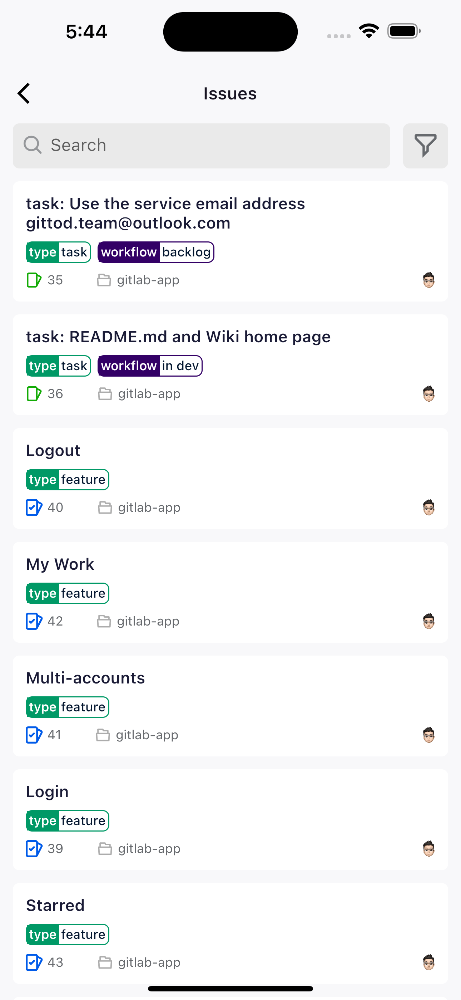
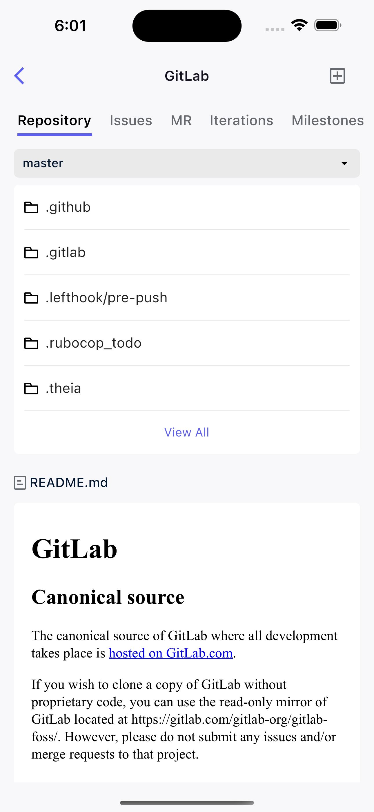
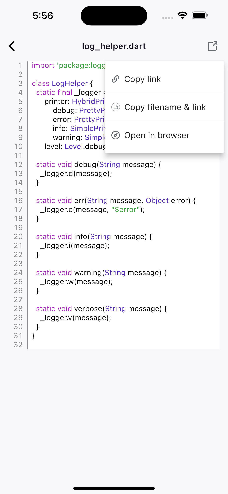
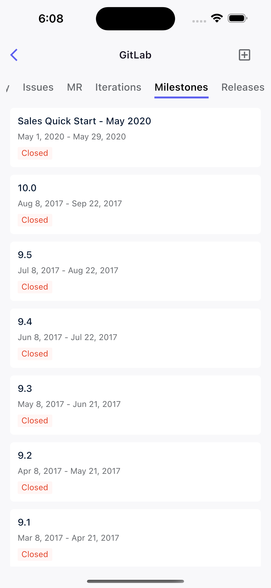
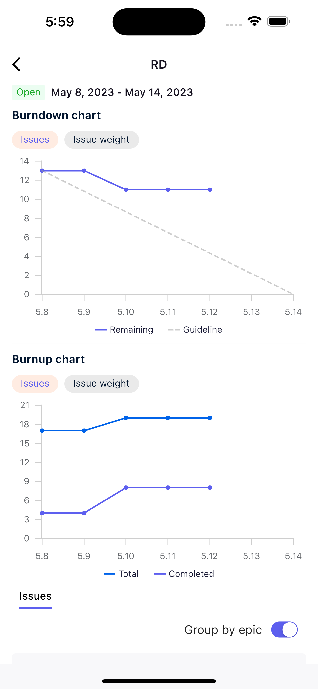
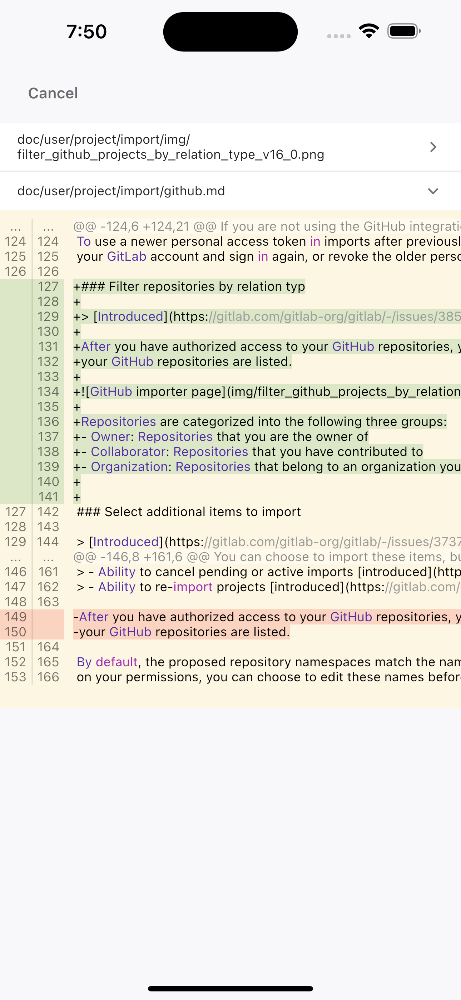

# GitTod App for gitlab

GitTod is designed to make it easier for people to use [GitLab](https://gitlab.com/gitlab-org/gitlab)。

## Canonical source

The canonical source of GitTod where all development takes place is hosted
on [GitLab.com](https://gitlab.com/patballoon/gitlab-app).

## About GitTod

We think GitTod's simple interface and features will help you get the most out
of [GitLab](https://gitlab.com/gitlab-org/gitlab).

## Features

| **No.** | **Feature**                                                            | **Status** |
|---------|------------------------------------------------------------------------|:----------:|
| #39     | **Login**                                                              |     ✅      |
| #40     | **Logout**                                                             |     ✅      |
| #41     | **Multi-accounts**                                                     |     ✅      |
| #42     | **My Work**                                                            |     ✅      |
| #43     | **Starred**                                                            |     ✅      |
| #44     | **User Issues**                                                        |     ✅      |
| #45     | **User Merge Requests**                                                |     ✅      |
| #46     | **User Projects**                                                      |     ✅      |
| #47     | **User Groups**                                                        |     ✅      |
| #48     | **To-dos**                                                             |     ✅      |
| #49     | **Profile**                                                            |     ✅      |
| #50     | **Repository**                                                         |     ✅      |
| #51     | **Share the code file**                                                |     ✅      |
| #52     | **Iterations**                                                         |     ✅      |
| #53     | **Burn down&up chart**                                                 |     ✅      |
| #54     | **Milestones**                                                         |     ✅      |
| #55     | **Releases**                                                           |     ✅      |
| #56     | **Switch Language**                                                    |     ✅      |
| ...     | **[Kanban board](https://jihulab.com/patballoon/gitlab-app/-/boards)** |     🕐     |

_For additional features and progress, please see
our [Kanban board](https://jihulab.com/patballoon/gitlab-app/-/boards). The API used for these functions correspond to
the [documents](https://docs.gitlab.com/ee/api/)._

#### Screenshots

    
    
    
    
    
    
    
    
    
    
    
    

## Thanks for

[JiHu GitLab App](https://jihulab.com/ultimate-plan/jihu-gitlab-app/jihu-gitlab-app).

_GitTod is based on the [JiHu GitLab App](https://jihulab.com/ultimate-plan/jihu-gitlab-app/jihu-gitlab-app)._

